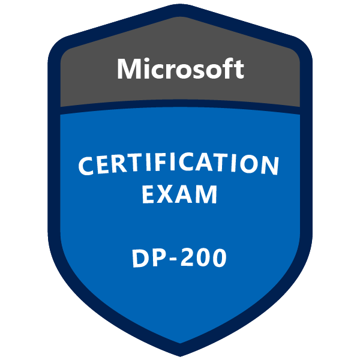

# Microsoft Certified: Azure Data Engineer Associate

  

## DP-200: Implementing an Azure Data Solution
- This was a exam I completed while studying for the [Microsoft Certified: Azure Data Engineer Associate](https://docs.microsoft.com/en-us/learn/certifications/azure-data-engineer) exam
- [Rudra Trainings ](https://www.youtube.com/playlist?list=PLiduTVoXzeTAkbUlfiE7UIL9LE8Bo4_jm) has a great playlist on how to build a big data solution using Azure technologies
- [Taygan Rifat](https://www.taygan.co/blog/2019/12/31/dp-200-implementing-an-azure-data-solution-exam-prep) has a great blog post summarizing key points needed to pass this exam