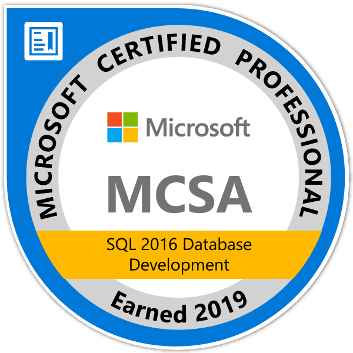

# MS_Certs

  

## Microsoft Certifications 
This is a collection of learning resources for Microsoft Certifications I am interested in or have completed. 

## My badges

  
  
  
  
  
  

## Microsoft Certifications
MTA: Database Fundamentals 
- [x] [90-364 Database Fundamentals](https://docs.microsoft.com/en-us/learn/certifications/exams/98-364)

MCSA: Database Development SQL 2016 
- [x] [70-761: Querying Data with Transact-SQL](https://docs.microsoft.com/en-us/learn/certifications/exams/70-761)
- [x] [70-762: Developing SQL Databases](https://docs.microsoft.com/en-us/learn/certifications/exams/70-762)

Microsoft Certified: Azure Data Engineer Associate
- [x] [DP-203: Implementing an Azure Data Solution](https://github.com/luyandamncube/MS_Certs/tree/main/dp-203)

Microsoft Certified: Azure Administrator Associate
- [ ] [AZ-104 Microsoft Azure Administrator](https://learn.microsoft.com/en-us/certifications/azure-administrator/)

## Microsoft Certified: DevOps Engineer Expert
- [ ] [AZ-400 Designing and Implementing Microsoft DevOps Solutions](https://learn.microsoft.com/en-us/certifications/devops-engineer/)

and maybe someday...

Microsoft Certified: Azure Solutions Architect Expert
- [ ] [AZ-305 Designing Microsoft Azure Infrastructure Solutions](https://learn.microsoft.com/en-us/certifications/azure-solutions-architect/)

## Databricks Exams
- [ ] [Databricks Lakehouse Fundamentals](https://www.databricks.com/learn/training/lakehouse-fundamentals-accreditation)

Databricks Data Engineer Associate
- [ ]  
